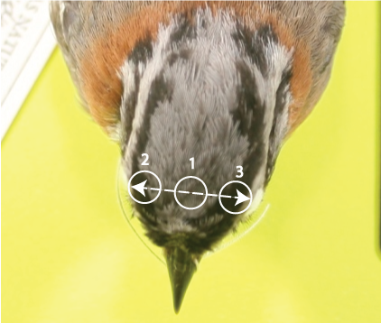

```{r setup, include=FALSE}
knitr::opts_chunk$set(echo = TRUE)

setwd("/Users/Ana/Desktop/Coloracion_chingolos")
```

# **PATRONES DE COLORACION CHINGOLOS**

## _1) ESPECTROFOTOMETRIA_
 
Con Pablito hicimos una prueba piloto midiendo espectros de reflectancia en tres posiciones de la cabeza. Siguiendo una linea recta en la cabeza yendo de un ojo al otro, medimos reflectancia en tres puntos (medidas 1 a 3) para luego comparar el promedio de estas tres mediciones entre ejemplares (Figura 1).  

  

Ademas medimos la espalda en el centro arriba (4) y el costado del collar rufo (medicion 5, del lado que mejor se veia porque a veces queda escondido en el cuello de la piel)


```{r reflectancia}
library(pavo)


chingos <- getspec("/Users/Ana/Desktop/Coloracion_chingolos/Spectra", ext = 
                     "txt", decimal = ",", subdir = TRUE, subdir.names = FALSE)

#visualizar los espectros, como para ver que sean mas o menos lo que esperamos
plot(chingos)

#promediar los espectros que son replicas de un mismo individuo. En este caso 
#tomamos tres puntos por bicho (5 veces cada punto), asi que by = 5. Ojo aca hay
#que chequear que no falte ninguno y que queden correlativos en la carpeta para 
#que los promedios de a 3 correspondan al mismo individuo y la misma medicion.
#Podriamos promediar los 15, pero lo hago por medicion para que podamos ver si 
#queremos comparar algun punto de medicion en particular, o el color de la 
#cabeza en general, o ambos.

chingos_bymeasurement <- aggspec(chingos, by = 5, FUN = mean)


#eliminar valores negativos (si hay)
chingos_bymeasurement_sn <-procspec(chingos_bymeasurement, fixneg='zero')

#ahora hacemos subgrupos de espectros en base a los parches, tenemos que tener 4
#espectros para cada uno de los 5 parches (74042 y 74051 son bichos 
#"australis-like" y 74010 y 74019 son "elresto-like")


chingos_p1 <- subset(chingos_bymeasurement_sn, "_1_")
chingos_p2 <- subset(chingos_bymeasurement_sn, "_2_")
chingos_p3 <- subset(chingos_bymeasurement_sn, "_3_")
chingos_p4 <- subset(chingos_bymeasurement_sn, "_4_")
chingos_p5 <- subset(chingos_bymeasurement_sn, "_5_")

plot(chingos_p1)
plot(chingos_p2)
plot(chingos_p3)
plot(chingos_p4)
plot(chingos_p5)
```
El parche 5 (collar rufo) muestra que todos los bichos son similares... no separaria por subespecie. El resto muestra variacion pero habria que ver si los agrupa por subespecie o son diferencias interindividuales...

```{r}
explorespec(chingos_p1)

#el ploteo por individuo muestra que los dos que tienen reflectancia mas baja 
#son uno de cada uno de los morfos... en principio este parche no diferenciaria

explorespec(chingos_p2)

#en este caso 10 y 19 tienen valores menores (<10% reflectacia), consistentes 
#con sus franjas negras mas pronunciadas, mientras que 42 y 51 estan alrededor
#de 10%. 

explorespec(chingos_p3)

#lo mismo pasa en 3, consistente con 2 y lo esperado

explorespec(chingos_p4)

#en la espalda parece que uno de los chingolos "normales" tiene reflectancia mas
#alta que el resto, pero no parecen agrupados por subespecie.
```
Voy ahora a agrupar por "subespecie" y graficar con media y desvio para ver si en estas dos muestras por grupo se aprecian diferencias significativas, aunque obviamente no es lo mas correcto ni mucho menos. Tengo que renonbrar los espectros para poder agruparlos... Bajar CSV, modificar nombres y volver a cargar.

```{r}
#renombrar las columnas para que incluyan el nombre de la "subespecie" 
#(normal=con barras; gris= australis)
nombres_p1<-c("n_74010_1", "n_74019_1", "a_74042_1", "a_74051_1")
colnames(chingos_p1)[2:5]<- nombres_p1
nombres_p2<-c("n_74010_2", "n_74019_2", "a_74042_2", "a_74051_2")
colnames(chingos_p2)[2:5]<- nombres_p2
nombres_p3<-c("n_74010_3", "n_74019_3", "a_74042_3", "a_74051_3")
colnames(chingos_p3)[2:5]<- nombres_p3
nombres_p4<-c("n_74010_4", "n_74019_4", "a_74042_4", "a_74051_4")
colnames(chingos_p4)[2:5]<- nombres_p4
nombres_p5<-c("n_74010_5", "n_74019_5", "a_74042_5", "a_74051_5")
colnames(chingos_p5)[2:5]<- nombres_p5


#armar grupos por subespecie para graficar promedio de cada parche

chingos_p1_subsp <-gsub('[^an]', "", colnames(chingos_p1))[-1]
table(chingos_p1_subsp)
chingos_p1_spec_bysubsp <- aggspec(chingos_p1, by=chingos_p1_subsp, FUN=mean)
aggplot(chingos_p1, chingos_p1_subsp, FUN.error=function(x)sd(x)/sqrt(length(x)),
        legend=TRUE, ylim=c(0,20))


chingos_p2_subsp <-gsub('[^an]', "", colnames(chingos_p2))[-1]
table(chingos_p2_subsp)
chingos_p2_spec_bysubsp <- aggspec(chingos_p2, by=chingos_p2_subsp, FUN=mean)
aggplot(chingos_p2, chingos_p2_subsp, FUN.error=function(x)sd(x)/sqrt(length(x)),
        legend=TRUE, ylim=c(0,20))


chingos_p3_subsp <-gsub('[^an]', "", colnames(chingos_p3))[-1]
table(chingos_p3_subsp)
chingos_p3_spec_bysubsp <- aggspec(chingos_p3, by=chingos_p3_subsp, FUN=mean)
aggplot(chingos_p3, chingos_p3_subsp, FUN.error=function(x)sd(x)/sqrt(length(x)),
        legend=TRUE, ylim=c(0,20))

chingos_p4_subsp <-gsub('[^an]', "", colnames(chingos_p3))[-1]
table(chingos_p4_subsp)
chingos_p4_spec_bysubsp <- aggspec(chingos_p4, by=chingos_p4_subsp, FUN=mean)
aggplot(chingos_p4, chingos_p4_subsp, FUN.error=function(x)sd(x)/sqrt(length(x)), 
        legend=TRUE, ylim=c(0,35))

chingos_p5_subsp <-gsub('[^an]', "", colnames(chingos_p5))[-1]
table(chingos_p5_subsp)
chingos_p5_spec_bysubsp <- aggspec(chingos_p5, by=chingos_p5_subsp, FUN=mean)
aggplot(chingos_p5, chingos_p5_subsp, FUN.error=function(x)sd(x)/sqrt(length(x)), 
        legend=TRUE, ylim=c(0,30))
```

  
  **Variables espectrales**: creo que vale la pena guardarlas, despues ver cuales sirven (seguro B2 como indicador de brillo en la cabeza).

```{r}
summary(chingos_p1)
summary(chingos_p2)
summary(chingos_p3)
summary(chingos_p4)
summary(chingos_p5)
```

**Calculo de dS (Vorobyev and Osorio 1998)**: los chingolos, como Emberizidos, se supone que son UV-S. En el primer paso se calculan los quatum catches (cantidad de fotones que llegan a cada tipo de cono)
```{r}
chingos_p1_uv <- vismodel (chingos_p1, visual="avg.uv", achromatic="bt.dc", relative=FALSE, vonkries=TRUE, scale=1, bkg="ideal")
chingos_p2_uv <- vismodel (chingos_p2, visual="avg.uv", achromatic="bt.dc", relative=FALSE, vonkries=TRUE, scale=1, bkg="ideal")
chingos_p3_uv <- vismodel (chingos_p3, visual="avg.uv", achromatic="bt.dc", relative=FALSE, vonkries=TRUE, scale=1, bkg="ideal")
chingos_p4_uv <- vismodel (chingos_p4, visual="avg.uv", achromatic="bt.dc", relative=FALSE, vonkries=TRUE, scale=1, bkg="ideal")
chingos_p5_uv <- vismodel (chingos_p5, visual="avg.uv", achromatic="bt.dc", relative=FALSE, vonkries=TRUE, scale=1, bkg="ideal")

```

En el segundo paso calculamos los dS entre pares de subespecies propiamente dichos.... hay que tener en cuenta que si la idea es comparar un gradiente de transicion este approach no funciona porque es para comparar grupos establecidos a priori. Podria indicar si hay diferencias perceptuales entre los extremos tal vez. Para ver la transicion habria que usar las variables espectrales me parece...

tambien creo que se podria hacer un "todos contra todos" y ver distancia de color versus longitud, por ejemplo. El problema con esto es que los colores con baja reflectancia, como el negro, suelen ser ruidosos y los valores de dS son muy sensibles a eso. 


```{r}
chingos_p1_dist_uv <- coldist (chingos_p1_uv, noise="neural", n=c(1,2,2,4), weber=0.1, subset=c("a", "n"))

chingos_p2_dist_uv <- coldist (chingos_p2_uv, noise="neural", n=c(1,2,2,4), weber=0.1, subset=c("a", "n"))

chingos_p3_dist_uv <- coldist (chingos_p3_uv, noise="neural", n=c(1,2,2,4), weber=0.1, subset=c("a", "n"))

chingos_p4_dist_uv <- coldist (chingos_p4_uv, noise="neural", n=c(1,2,2,4), weber=0.1, subset=c("a", "n"))

chingos_p5_dist_uv <- coldist (chingos_p5_uv, noise="neural", n=c(1,2,2,4), weber=0.1, subset=c("a", "n"))

print(chingos_p1_dist_uv)

print(chingos_p2_dist_uv)

print(chingos_p3_dist_uv)

print(chingos_p4_dist_uv)

print(chingos_p5_dist_uv)
```

No lo hice en este caso porque tenemos solo dos mediciones de cada grupo, pero para comparaciones con mayor cantidad de muestras se puede (debe) hacer un calculo del intervalo de confianza para el calculo de dS.

CONCLUSIONES: creo que vale la pena hacer mediciones de la cabeza, y de algunos otros parches para tener datos espectrofotometricos para incorporar al analisis, mas alla de lo que despues logremos hacer con las fotos. Creo que con los espectros podemos ver por ej, si hay diferencias en los pigmentos (si las curvas son diferentes) o si son cambios de concentracion (creo que es lo que pasa). tambien al medir otros parches, mas alla de la cabeza, podemos ver si las diferencias en la deposicion de melaninas ocurren (con menor intensidad tal vez) tambien en otros parches de plumaje. Si las diferencias por ejemplo tuvieran que ver con necesidad de recibir mayor radiacion UV (porque viven muy al sur y hay poco sol) entonces se esperaria que todo el cuerpo sea mas clarito. Idem para la regla de Gloger, supongo....

Proxima entrega, analisis con fotos.